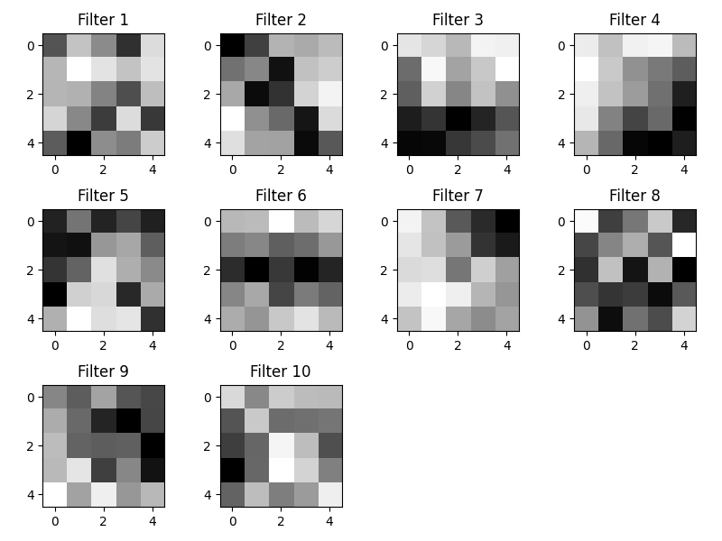
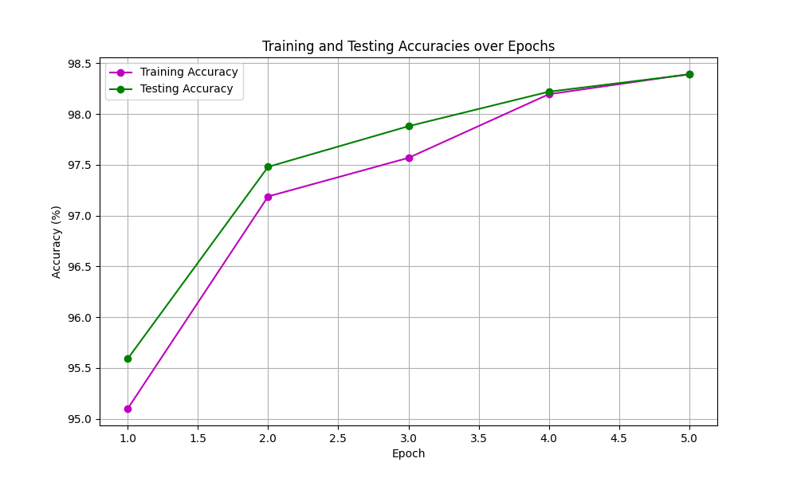
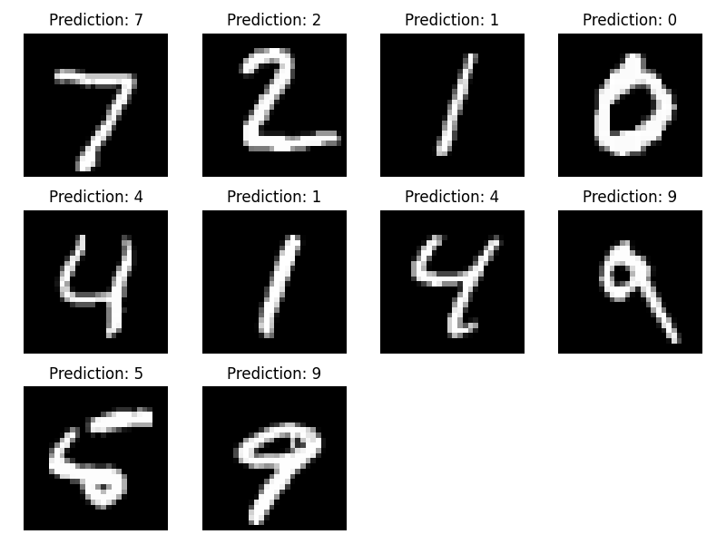
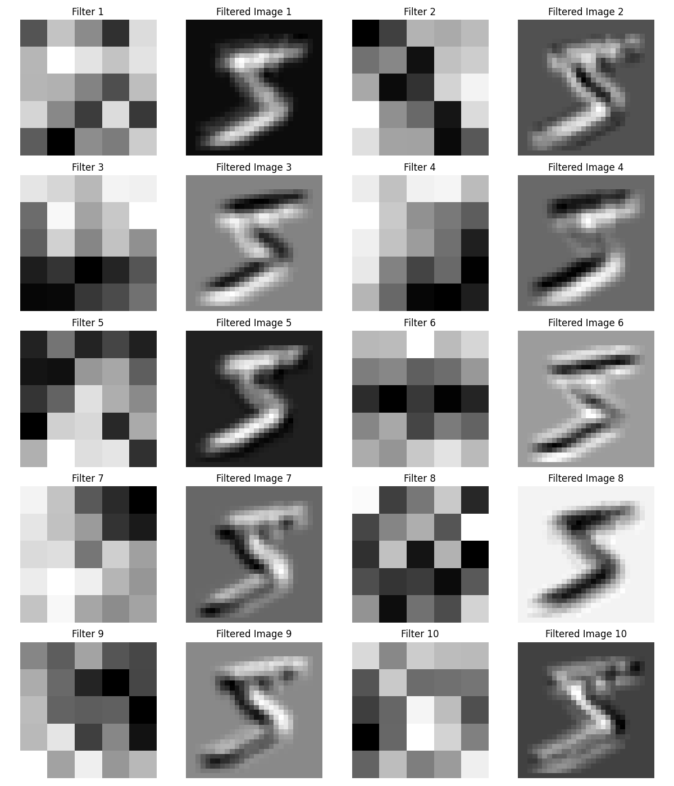
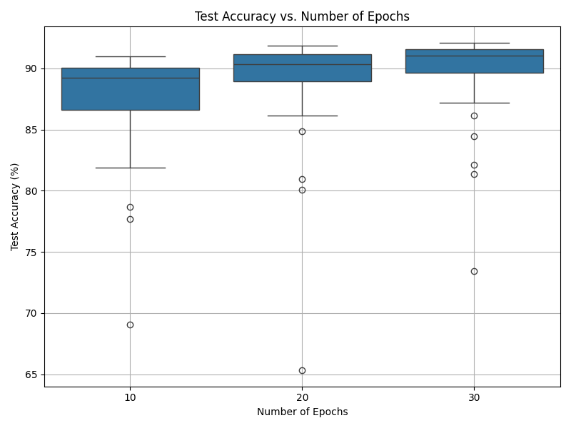
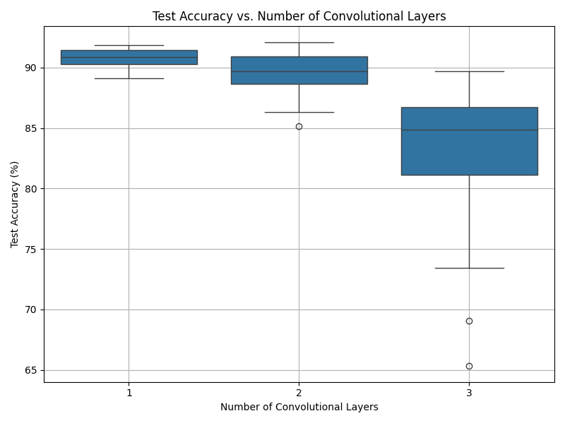

# Deep Neural Networks for Digit and Greek Letter Recognition



## 📑 Overview

This project implements Convolutional Neural Networks (CNNs) for recognizing handwritten digits and Greek letters. The implementation includes training models from scratch, transfer learning, hyperparameter experimentation, and extensions such as GAN image generation and live digit recognition.

## 👥 Team Members

- **Yuyang Tian**
- **Arun Mekkad**

## 🔍 Features

- **MNIST Digit Recognition**: Train and test a CNN on the MNIST dataset
- **Network Examination**: Visualize convolutional filters and their effects
- **Transfer Learning**: Apply knowledge from digit recognition to Greek letter recognition
- **Hyperparameter Experimentation**: Evaluate different CNN architectures
- **DC-GAN Implementation**: Generate synthetic face images
- **Live Digit Recognition**: Real-time recognition through a drawing interface

## 📊 Results

### Digit Recognition Performance

The model achieves high accuracy on the MNIST test set:




### Convolutional Layer Visualization

Visualizing the CNN's first layer filters and their effect on input images:



### Hyperparameter Experiments

Impact of different hyperparameters on model performance:




## 🛠️ Installation

1. Clone this repository
2. Install requirements:
   ```
   pip install torch torchvision matplotlib numpy pandas opencv-python pillow
   ```

## 🚀 Usage

### Digit Recognition

Train a model on MNIST:
```bash
python src/train.py
```

Test the model:
```bash
python src/test.py
```

Test on custom handwritten digits:
```bash
python src/test.py data/Handwritten
```

### Greek Letter Recognition

Train on Greek letters:
```bash
python src/train_greek.py
```

With extension (5 letters):
```bash
python src/train_greek.py --extension
```

Test Greek letter recognition:
```bash
python src/test_greek.py
```

### Network Visualization

Examine the network's convolutional layers:
```bash
python src/examine.py
```

### Hyperparameter Experimentation

Run experiments with different architectures:
```bash
python src/experiment.py
```

### DC-GAN

Train the GAN:
```bash
python src/train_dcgan.py
```

Visualize generated images:
```bash
python src/visualize_gan.py
```

### Live Digit Recognition

Launch the interactive drawing interface:
```bash
python src/live_digit_recognition.py
```

## 📂 Project Structure

```
Project/
├── data/                 # Data files
│   ├── MNIST/            # MNIST dataset
│   ├── Handwritten/      # Custom handwritten digits
│   ├── greek_train_3/    # 3-class Greek letter dataset
│   ├── greek_test_3/     # Test set for 3 Greek letters
│   ├── greek_train_5/    # 5-class Greek letter dataset
│   ├── greek_test_5/     # Test set for 5 Greek letters
│   └── celeba_10k/       # Subset of CelebA dataset
├── src/                  # Source code
│   ├── train.py          # Train CNN on MNIST
│   ├── test.py           # Test trained models
│   ├── examine.py        # Visualize network layers
│   ├── experiment.py     # Run hyperparameter experiments
│   ├── train_greek.py    # Transfer learning for Greek letters
│   ├── test_greek.py     # Test Greek letter recognition
│   ├── train_dcgan.py    # Train DC-GAN
│   ├── visualize_gan.py  # Generate images with DC-GAN
│   ├── live_digit_recognition.py # Interactive recognition GUI
│   └── plot.py           # Helper functions for visualization
├── trained_models/       # Saved model weights
├── outputs/              # Generated GAN images
└── Plots/                # Visualization images
```

## 🧪 Experiments

Extensive experiments were conducted to find optimal hyperparameters for the CNN architecture:

- Filter sizes (3×3, 5×5, 7×7)
- Number of filters per layer (8, 16, 32, 64)
- Number of convolutional layers (1-4)
- Dropout rates (0-0.5)
- Number of training epochs

The best performance was achieved with 3 convolutional layers, 32 filters per layer, a filter size of 3×3, and a dropout rate of 0.2.

## 📝 Extensions

1. **Enhanced Greek Letter Recognition**: Support for 5 Greek letters (alpha, beta, gamma, lambda, theta)
2. **DC-GAN Implementation**: Generating realistic face images using deep convolutional GANs
3. **Interactive Digit Recognition**: Real-time recognition through a Tkinter-based drawing interface
